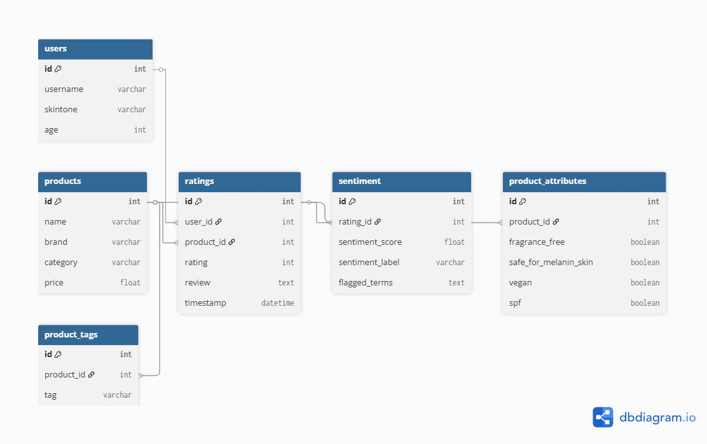

```{r setup, include=FALSE}
knitr::opts_chunk$set(echo = TRUE)
library(tidyverse)
library(ggplot2)
library(data.table)
library(Rtsne)
library(Matrix)
library(reshape2)
library(dplyr) # Explicitly load dplyr for distinct()
```

# Final Project Overview
Project Title: Clean Beauty Recommender: Exploring Latent Insights from Skincare Reviews  
Course: DATA 612 – Recommender Systems  
Name: Sheriann McLarty

This project expands on my earlier Clean Beauty Recommender by exploring latent factor models and embedding visualization to better understand product similarities and improve recommendation accuracy, particularly for users with medium to deep skin tones.

---

## Dataset
I'm using a filtered dataset with:

- Numeric ratings
- User reviews with sentiment labels and flagged terms (e.g., "rash", "burn", "sting")
- Product metadata (category, SPF, vegan, fragrance-free)
- User attributes (age, skintone)

The dataset contains over 10,000 reviews and supports multiple recommender strategies.

---

## System Architecture
- Latent Factor Modeling (SVD) to generate product embeddings
- PCA & t-SNE for dimensionality reduction and visualization
- K-means clustering to interpret product similarities within the latent space
- Sentiment-based filtering to prioritize product safety and exclude products with harmful effects for sensitive skin

---

## Current Workflow & Visualization

The core of the current workflow involves creating a user-item interaction matrix, applying Singular Value Decomposition (SVD) to extract latent features (product embeddings), and then using t-SNE for dimensionality reduction to visualize these embeddings. K-means clustering is applied to the t-SNE results to reveal natural groupings of products based on their learned similarities.

```{r latent-space-tsne, warning=FALSE, message=FALSE}
# Load ratings matrix
df <- fread("filtered_skintone_reviews.csv")

# Create user-item matrix
ratings_matrix <- as.matrix(acast(df, author_id ~ product_id, value.var = "rating_x", fill = 0))

# Reduce dimensions using SVD
svd_res <- svd(ratings_matrix)
product_embeddings <- svd_res$u[, 1:10] %*% diag(svd_res$d[1:10])

# Convert to data frame and keep track of product ID
embeddings_df <- as.data.frame(product_embeddings)
embeddings_df$product_id <- rownames(ratings_matrix)

# --- Addressing the Rtsne Duplicate Error ---
# Step 1: Isolate numerical embeddings
numerical_embeddings_only <- embeddings_df[, 1:10]

# Step 2: Round the numerical embeddings to a fixed number of decimal places.
rounded_embeddings <- round(numerical_embeddings_only, digits = 6)

# Step 3: Create a data.table from the rounded embeddings for robust unique identification
rounded_embeddings_dt <- as.data.table(rounded_embeddings)

# Step 4: Identify unique rows
unique_indices_from_rounded <- !duplicated(rounded_embeddings_dt)

# Step 5: Filter using unique indices
unique_embeddings_final_df <- embeddings_df[unique_indices_from_rounded, ]

# Run t-SNE
set.seed(123)
tsne_res <- Rtsne(as.matrix(unique_embeddings_final_df[, 1:10]), dims = 2, perplexity = 30)

# Build the t-SNE dataframe
tsne_df <- data.frame(
  X = tsne_res$Y[, 1],
  Y = tsne_res$Y[, 2],
  product_id = unique_embeddings_final_df$product_id
)

# K-means clustering
set.seed(123)
tsne_df$cluster <- kmeans(tsne_df[, c("X", "Y")], centers = 5, nstart = 25)$cluster

# Merge with product names
tsne_df <- merge(tsne_df, unique(df[, .(product_id, product_name_x)]), by = "product_id", all.x = TRUE)

# Plot
ggplot(tsne_df, aes(x = X, y = Y, color = as.factor(cluster), label = product_name_x)) +
  geom_point(alpha = 0.6) +
  labs(title = "K-Means Clustering on Product t-SNE Embeddings",
       x = "t-SNE Dimension 1",
       y = "t-SNE Dimension 2",
       color = "Cluster") +
  theme_minimal() +
  guides(color = guide_legend(override.aes = list(size = 4)))
```

---

## Entity-Relationship Diagram (ERD)
This ERD represents the structure of the cleaned review dataset, including user, product, and review-level information.

```{r, echo=FALSE, out.width='100%'}

```

---

## Lessons from Project 3
When I first visualized the latent space, I wasn’t sure what to expect. I was honestly nervous about whether my system was even working. But seeing products naturally cluster helped me realize that the recommender was learning useful relationships. The ability to identify these clusters gives me confidence, and I plan to use these techniques in my final project to validate the fairness and coherence of future recommendations.

---

## Unique Elements
- Integrates sentiment flags like “rash”, “burn”, “sting” for enhanced safety and user trust
- Focused approach on underserved skin tones (medium to deep) to address specific skincare needs
- Embedding-based validation and visualization through t-SNE and K-means clustering to interpret model learnings

---

## Inspiration & Next Steps
I was inspired by a Kaggle notebook that used SVD + t-SNE to visualize product embeddings, demonstrating how these plots could validate a recommender’s behavior. I plan to expand this for the final project.

### Potential Next Steps:
- Add image or text metadata (e.g., product descriptions, ingredients lists) to enrich embeddings
- Explore LLM-based enrichment for advanced product descriptors or summaries
- Apply Spark or parallel workflows for scaling the recommender system on larger datasets
- Further test fairness and bias across different user attributes, particularly skin tones

```{r llm-enhancement-simulated, eval=FALSE}
# Simulate a pipeline for LLM-style enhancement
# You can later replace this with a real OpenAI or HuggingFace call

sample_reviews <- df %>% 
  select(product_name_x, review_text) %>% 
  group_by(product_name_x) %>% 
  summarise(summary = paste(review_text[1:3], collapse = " "))

# Add mock LLM summary column
sample_reviews <- sample_reviews %>%
  mutate(llm_summary = paste("Summary for", product_name_x, ":", substr(summary, 1, 200), "..."))

head(sample_reviews)
```

---

## Deliverables
- Planning Document (this .Rmd)
- Final Presentation Video (5 mins)
- Final Report (.Rmd or .ipynb)
- Optional Enhancements (APIs, image/text data, LLMs)

---

Sheriann McLarty | DATA 612 | Summer 2025
